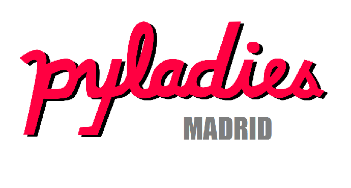

# Taller 002 - PyLadies Madrid: "Estructuras de control, Funciones y Primeros Scripts"

     
     

## Agenda:

* Retos prácticos - repaso taller 001.
* Condicionales - if/elif/else
* Bucles - for
* Bucles - while
* Funciones
* Retos prácticos

## Impartido por:
* Mabel Delgado
* María Medina

## Con la colaboración de:

## Convocatorias:

* [Primera convocatoria](https://www.meetup.com/es-ES/PyLadiesMadrid/events/247325544/): Lunes 12 de Febrero de 2018.

## Requisitos:

* Ordenador y muchas ganas de aprender y pasarlo bien.
